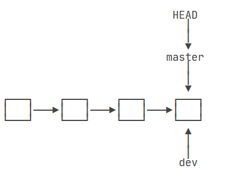

# 工作区与版本库

## 相关指令

### 初始化仓库

`git init` -----将当前这个目录变成git可以管理的【仓库】  右击目录点击git bash here  最后会生成一个.git文件，用来跟踪管理版本库的

### 文件放入仓库

（1）`git add xxx`----将文件添加到仓库（这个文件必须建立在这个目录的目录/子目录下）------这里是将文件提交给了.git版本库中的==**暂存区（stage/index）**== 
（2）`git commit -m` "解释本次提交操作" ---------把文件提交到仓库-------这里是【一次性】将暂存区中的所有添加修改**==提交到master分支当中==**（master也是存在于.git版本库当中的）
包括删除的操作，也需要commit再次更新git status-----查看仓库当前状态（有文件是否修改，修改后是否未添加和提交）
（3）`git diff`-----查看文件修改内容（文本文件可以查看具体内容）
（4）`git log`-----显示最近到最远的提交日志  head对应当前版本   $ git log --pretty=oneline可以查看版本号
（5）`git reflog`-----查看历史命令

### 撤销操作

（1）`git checkout -- xxx` -------更改xxx文件回到最近一次commit时或者add时的状态（前提时这个文件没有被commit），其实这个命令是用版本库里面的版本替换工作区的版本，无论工作区时修改还是删除，都可以一键还原

使用场景：（1）修改了工作区，还没有提交给暂存区

（2）`git reset HEAD xxx`--------可以把暂存区的修改撤销掉，重新放回工作区

（3）`git reset --hard HEAD^`------将文件回退到上一个版本（HEAD^表示上一个版本，HEAD^^表示上上个版本）
（4）`git reset`还可以向前版本，即根据之前的log日志，查看之前的版本号，再hard后面跟上版本号前几个字母，就可以回到那个版本号

### 删除操作

`git rm xxx`------从版本库中删除某文件  +    `git commit`-----删除也是一种修改，需要再次提交

`git branch -d <name>`--------删除分支

`git remote rm origin`-------------删除与远程库的绑定关系

### 注意

如果修改了工作区（文档内容，但是没有add），显示下面状态

如果add至暂缓区但是没有commit提交

`git reset HEAD xxx` 可以撤销add

# 关于远程库（repository）

## 相关指令

（1）我们的github仓库就类似于一个服务器仓库（大家远程提交项目拉项目的地方），通过在github账号配置ssh key，这样github就知道是谁再推送内容了
（2）通过 `git remote add origin git@github.com:xfn970/learngit.git`关联当前本地库和github上的learngit库
（3）第一次使用`git push -u origin master`进行提交分支，后面都用`git push origin master`直接提交
（4）`git remote -v`查看远程库信息
（5）`git remote rm origin` 此处的“删除”其实是解除了本地和远程的绑定关系，并不是物理上删除了远程库。远程库本身并没有任何改动。要真正删除远程库，需要登录到GitHub，在后台页面找到删除按钮再删除。

## 现有本地库，后有远程库，如何关联远程库

1、首先需要去github个人账户配置ssh key，一般是在自己的电脑上通过命令得到ssh文件夹（在C:\Users\XFN\.ssh），然后将里面的id_rsa.pub的内容贴到配置里面去，这样就相当于我可以向这个仓库推送内容了

2、一般来说，我在本地已经建立了learngit仓库，但是我又在github仓库里面新建了一个仓库，因此我想要这两个仓库远程同步，需要以下步骤：

（1）在github里面新建一个git仓库，也叫learngit（我们可以从这个仓库克隆出新的仓库，也可以关联本地已有的仓库，这里是关联本地仓库）

（2）然后在本地的learngit仓库下运行命令（将目前的这个本地git仓库关联到xfn970的learngit.git的仓库中）：

$ git remote add origin [git@github.com:**xfn970**/learngit.git](mailto:git@github.com:xfn970/learngit.git)

**注意：**在这个操作之前可以命令ping以下目前是否能获取到**github的ip**！！如果不能获取，则通过收藏的网址，获取到github.com的ip后，将其写入C:\Windows\System32\drivers\etc目录下的hosts文件中的最后一行，这样我们才能访问到github账户进行关联。

（3）添加后，我们就有一个origin远程库，我们就可以利用`git push -u origin master`将本地库内容推送到关联的库中（后面直接git push就好了）

**注意：**第一次push或者clone的时候会出现以下内容，直接回车即可

## 先创建远程库，然后从远程库克隆

==**（相当于从github上面拉一个仓库的内容下来，这个时候其实还是跟远程库远程关联的，一旦修改提交后，可以先git pull，然后git push就可以提交给远程库了）**==

### Ssh方式

1、首先在github上面新建仓库

2、找到一个文件夹，用git clone [git@github.com:xfn970/gitskills.git](mailto:git@github.com:michaelliao/gitskills.git)命令将仓库复制（下载）下来，这样就可以在本地看到这个仓库的内容了（这里也可以用http进行下载）

### http方式

git clone https://github.com/xfn970/gitskills.git

# 关于分支（branch）

**说明：**

初始化git时会有一个master主分支生成，在实际开发过程中，一般会创建其他分支进行开发，其他分支开发不会影响master主分支的开发。

**优点：**

（1）可以同时并行开发多个功能，提高开发效率；

（2）多个分支同时开发时，一个分支开发失败，不会影响其他分支的开发，将失败分支删除重新开始即可。

## 创建和合并分支（快进模式）

一开始的时候，master分支是一条线，Git用master指向最新的提交，再用HEAD指向master，就能确定当前分支，以及当前分支的提交点

1、`git switch -c dev` 新建dev分支并切换到该分支  

**==注意==**：这里的dev是基于master分支开发出来的，因此它的内容是**基于**master分支的内容的，因此master所拥有的bug，dev也会有这个bug

2、`git branch` 查看分支 ***代表当前分支**

3、此时我们对里面的所有操作都是在dev分支上进行操作，比如给readme添加内容-》add文件-》commit修改

4、当我们用`git switch master` 切换分支回到master的时候就会发现readme内容也会回到之前的状态，即第三步操作会消失，因为我们之前的提交是在dev分支上，而master的提交点并没有改变

5、`git merge <name>` 合并dev分支到当前分支

此时Git告诉我们，这次合并是“快进模式”，也就是直接把master指向dev的当前提交，所以合并速度非常快。

6、`git branch -d <name>` 可以删除dev分支了（因为已经合并过了）

## 关于分支冲突

==**什么是分支冲突？合并分支时，两个分支在同一文件的同一位置有着不同的修改，这时git无法替代我们保留哪一个，需要我们手动介入修改。**==

**注意：**进入编辑模式后，按c开启编辑，按esc后+大写的两次Z，就可以退出编辑模式，:wq 保存文件并退出vi 编辑

### 冲突的产生

（1）新建分支fe1，修改后add+commit提交修改

（2）回到master分支，修改**同一文件的同一位置**add+commit提交修改

（3）此时产生冲突，即如下图所示

（4）此时再master上快速合并fe1，就会产生冲突报错（会告知错误的文件是readme.txt）,打开txt也会显示错误的地方，Git用`<<<<<<<`，`=======`，`>>>>>>>`标记出不同分支的内容

### 解决冲突

（1）将冲突的部分删除，重新写成自己想要的内容后，保存，再add+commit，此时master合并成功

（2）使用`git log --graph --pretty=oneline --abbrev-commit`可以查看分支情况，其中左边的都是master分支上的内容，右边是其他分支，从下往上是每个提交的版本号的展示

==每一个*代表一个commit提交点==，后面的一串数字字母是版本号，比如5ecf7c3对应master分支上的commit，而307c7b3对应fe1分支上的commit

（**注意：**其实fe1分支最后的节点是不指向合并后的提交节点的，这个有点类似于说我发现了冲突的地方之后，我就直接在master分支上对文档修改后再提交，就不关分支fe1的事情了）

（3）最后利用`git branch -d fe1`，删除fe1分支

**注意：**==我们是在master上将fe1分支合并进来，并不会影响到fe1分支的内容，因此fe1的内容还是保持原来commit的内容==

## 分支管理策略（非快进模式）

通常，合并分支时，如果可能，Git会用`Fast forward`模式，但这种模式下，删除分支后，会丢掉分支信息。

如果要强制禁用`Fast forward`模式，Git就会在merge时生成一个新的commit，这样，还是会保留分支历史的，从分支历史上就可以看出分支信息。

（1）新建dev分支并且add+commit

（2）切换回到master分支，利用`git merge --no-ff -m "merge with no-ff" dev`合并dev分支（禁止快速合并），因为本次合并要创建一个新的commit，所以加上`-m`参数，把commit描述写进去。

在实际开发中，我们应该按照几个基本原则进行**==分支管理==**：

首先，`master`分支应该是非常稳定的，也就是仅用来发布新版本，平时不能在上面干活；

那在哪干活呢？干活都在`dev`分支上，也就是说，`dev`分支是不稳定的，到某个时候，比如1.0版本发布时，再把`dev`分支合并到`master`上，在`master`分支发布1.0版本；

你和你的小伙伴们（michoel和bob）每个人都在`dev`分支上干活，每个人都有自己的分支，时不时地往`dev`分支上合并就可以了。

所以，团队合作的分支看起来就像这样：

## 快进模式和非快进模式的区别

（1）快进模式是直接令master指向dev的当前提交节点，再删除dev分支，这种情况下删除后的分支是不会保留操作信息的

（2）非快进模式则是会在master分支上产生新的提交节点，新的提交节点则是两个分支的合并结果

看到别人的理解：这里的--no--ff 模式其实就是相当于master指针new了一个跟dev指针一样的空间并且放了相同的内容然后指向这个空间。而原来的快速模式，就是简单将master指针指向dev指针指向的内容而已，并没有自己创造空间。

## BUG分支

情景：软件开发中，bug就像家常便饭一样。有了bug就需要修复，在Git中，由于分支是如此的强大，所以，每个bug都可以通过一个新的临时分支来修复，修复后，合并分支，然后将临时分支删除。

当你接到一个修复一个代号101的bug的任务时，很自然地，你想创建一个分支`issue-101`来修复它，但是，等等，当前正在`dev`上进行的工作还没有提交，为什么不提交呢？因为这件事情还没有做完，提交会破坏工程的稳定性；但是又不能在没有提交的情况下切换分支，否则会产生问题，问题在注意事项里面有。

（1）所以需要在切换分支之前，将目前该dev分支的内容暂存起来`git stash`

（2）然后切换回到需要修复的分支，假设需要修复的bug的分支是master，则在master的基础上新建修改bug的分支issue-101，在该分支上对bug进行修改提交，**此处要记住此次commit的版本号xxx**

（3）再切换回master分支，非快速合并issue-101分支后，此时master分支上的bug已经修改完毕，**注意不要删除issue-101分支（因为还需要它的commit节点）**

（4）切换回之前的dev分支，由于dev分支是由master分支引申出来的，故master有的bug，dev也会有这个bug，故先使用`git cherry-pick xxx`复制先前bug分支提交的版本号xxx，能复制一个特定的提交到当前分支，此时dev分支的bug修复完毕

（5）`git stash pop`恢复工作现场（stash内容删除）////`git stash apply`+`git stash drop`////////`git stash apply stash@{0}`（恢复指定的stash）

（6）删除issue-101分支

## 多人协作

当你从远程仓库克隆时，实际上Git自动把本地该文件的`master`分支和远程对应仓库的`master`分支对应起来了，并且，远程仓库的默认名称是`origin`。

`$ git remote -v`查看远程库信息，上面显示了可以抓取和推送的`origin`的地址。如果没有推送权限，就看不到push的地址

### 推送分支

命令：`$ git push origin 分支名称`

什么类型的分支需要**远程推送**呢？答案：小伙伴们共同开发的分支，如：master，dev.....

### 抓取分支

多人协作时，大家都会往`master`和`dev`分支上推送各自的修改。当从远程库clone时，默认情况下，只能看到本地的`master`分支。

（1）现在，要在`dev`分支上开发，就必须创建远程`origin`的`dev`分支到本地，于是他用这个命令创建**远程和本地`dev`分支**：
命令：`$ git switch -c dev origin/dev`   此时本地的dev分支和远程的dev分支处于关联状态

（2）利用push将修改提交到了远程的dev分支上

（3）此时，另外一个人也对同样的文件进行了修改，并试图推送，这时候就推送失败，因为你的小伙伴的最新提交和你试图推送的提交有冲突，解决办法也很简单，Git已经提示我们，先用`git pull`把最新的提交从`origin/dev`抓下来，然后，在本地合并，解决冲突，再推送

（4）在dev分支上写入命令：`git pull`拉取把**最新的提交**从`origin/dev`抓下来，但此时可能会报错，因为直接使用git pull的前提是这个dev分支是关联着远程dev分支的

（5）`$ git branch --set-upstream-to=origin/dev dev`将本地和远程的dev分支链接起来

（6）再使用`git pull`拉取，但是有可能会报冲突，此时手动修改冲突后，再次提交后，再push推送给远程dev

### 多人协作模式

1. 首先，可以试图用`git push origin <branch-name>`推送自己的修改；
2. 如果推送失败，则因为远程分支比你的本地更新，需要先用`git pull`试图合并；
3. 如果合并有冲突，则解决冲突，并在本地提交；
4. 没有冲突或者解决掉冲突后，再用`git push origin <branch-name>`推送就能成功！

注意：如果`git pull`提示`no tracking information`，则说明本地分支和远程分支的链接关系没有创建，用命令`git branch --set-upstream-to <branch-name> origin/<branch-name>`

建立链接之后，就可以直接用`git push和git pull`简写了

### 关于dev是否要先合并到master上再推送的问题

解答一：两种做法：

1. 在本地先把dev做了修改，然后切到本地master分支，然后用master合并dev，并在master上提交并push到远端；
2. 也可以在本地dev做了修改，然后push到远端的dev分支，用远端的master合并dev，在本地的master上用pull拉一下

解答二：

本地master分支和远程master分支同步，本地dev和远程dev同步，名字只是一个代号，切忌本地master同步远程dev这种，自己把自己绕进去。

你在本地dev开发，和远程dev同步是你的责任，不然其他人没法拿到你的commit

是否要把本地dev合并到本地master，看你的策略，如果每个commit你都立刻合并到master然后和远程同步，那要两个分支就没意义了。

正常开发是在某个大功能稳定是，由某个人把dev合并到master，同步远程master，最好打上v1.1，v1.2的标签，便于跟踪

# 关于标签

## 创建标签

（1）命令`git tag <tagname>`用于新建一个标签，默认为标签打在对应分支的最新的commit提交上面，也可以指定一个commit对应版本号打上标签；

（2）命令`git tag -a <tagname> -m "blablabla..."`可以指定标签信息；

（3）命令`git tag`可以查看所有标签

## 管理标签

1. 命令`git push origin <tagname>`可以推送一个本地标签；
2. 命令`git push origin --tags`可以推送全部未推送过的本地标签；
3. 命令`git tag -d <tagname>`可以删除一个本地标签；
4. 命令`git push origin :refs/tags/<tagname>`可以删除一个远程标签，但是前提是得删除对应的本地标签

# 一些试验的注意事项

## 关于初始化

开始初始化之后，需要提交一次节点才能切换分支，如果直接切换分支就会出现master分支消失（覆盖）的情况

## 关于分支写到一半提交会不会冲突的问题

如果某分支内容写到一半提交后且被合并了，分支接续补充修改相同文件的相同位置再次提交再被合并的时候并不会产生冲突（就算是相同文件的相同位置）,但是一般不会写一半就提交，这涉及到了个人认为这个跟设计理念有些关系，如果有些bug很紧急, 而你当前的修改只做到一半, 导致工程都无法启动起来。这时当然是可以 git commit（提交节点） 或者 git stash（当前工作现场“储藏”起来）

**那两者有什么区别?**

git commit 会在 git log 里面留下一次 log, 而你push之后别人是可以回退到你这个版本的, 不论什么原因, 如果别人到了你这个版本, 发现连工程都启动不起来, 自然会有很多疑问。

因此一次良好的 git commit 应该不要破坏工程的稳定性才对。

所以你不能把做到一半的代码进行 git commit.。

## 关于多个分支覆盖和冲突的问题

假设有三个分支，master、dev1、dev2

### 关于会不会覆盖的问题

切换到dev1，dev1中修改a文件后，add a文件，commit；

切换到dev2，dev2中也有a文件（但是不修改），添加了一个b文件，并且add b文件，commit；

切换到master后，首先非快速合并dev1分支，再非快速合并dev2分支，我们会发现：

（1）两个分支不会产生冲突

（2）dev2中的未修改的a文件也并不会覆盖掉dev1中已经修改的a文件

==**原因：**==因为在dev2中我们只修改了b文件，并且add添加到仓库的时候只是将b文件放到了暂存区，而commit也只是将暂存区中的b文件提交到dev2分支当中，并没有对a文件进行操作，因此在master中尽管先合并的dev1，但是在合并dev2的时候并不会覆盖a文件

### 关于冲突的问题

切换到dev1，dev1中修改a文件后，add a文件，commit；

切换到dev2，dev2中也修改了a文件，并添加了一个c文件，并且add a文件和c文件，commit；

切换到master后，首先非快速合并dev1分支，再非快速合并dev2分支，我们会发现：

（1）两个分支会产生冲突，冲突内容是a文件

**==原因：==**是因为**两个分支**都提交了相同文件的相同位置的修改结果，因此在master合并的时候就会产生冲突

### 关于分支上的修改不提交就切换分支

如果在dev分支工作区修改了但是不放到暂存区，再切换回master分支的时候，遇到了两种情况（dev分支是由master得出的）

（1）可以切换回master分支，但是添加/修改的内容也会出现在master分支当中（混乱，这样就不清楚这个修改到底属于哪一个分支的了）

（2）提示我在没有add和commit修改的时候，不可以切换分支

因此就需要用到git status将该分支目前的工作内容暂存起来

## 关于多人协作的开发流程

## 关于git分支的作用

远程的dev分支在服务器上，除非你登录到服务器，否则开发不了。

本地的dev分支在你机器上，直接可以操作，然后和服务器的dev同步。

git分支的作用一是同步，二是合并。（这里的dev分支是指大家协同合作后去往的合并分支）
